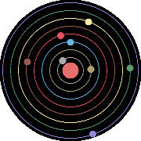

# S4W
*Simple Solar Sytem Simulation Watchface* 

Persistent and heliocentric.

A watchface that tells relative planet positions across time in space based on actual
data computed with Python3 [Skyfield](https://rhodesmill.org/skyfield/).

Features 8 major planets and the Sun.

Provides a common starting point - epoch - 1 January 1970.

Earth serves as a reference and helpfully points upward at the start of each year.

WARNING: messy code.

>  Shamelessly re-uses programming code from [Orbital RE](https://github.com/less-ly/orbital_re).

> And employs a Python3 script to compute relative planetry positions generated by [LLaMa](https://en.wikipedia.org/wiki/Llama_(language_model)).

If you are a knowledgable person, please, do reach out and point out if there are any astronomical
mistakes.
